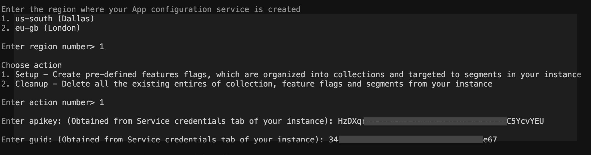

# Node.js Sample Application for IBM Cloud App Configuration service
> **DISCLAIMER**: This is a guideline sample application and is used for demonstrative and illustrative purposes only. This is not a production ready code.

This sample contains an Node.js project that you can use to learn more about the IBM Cloud App Configuration service.

## Contents
- [Node.js Sample Application for IBM Cloud App Configuration service](#nodejs-sample-application-for-ibm-cloud-app-configuration-service)
  - [Contents](#contents)
  - [Prerequisite](#prerequisite)
  - [Create an instance of App Configuration service](#create-an-instance-of-app-configuration-service)
  - [Setup the App Configuration service instance](#setup-the-app-configuration-service-instance)
  - [Run the sample app](#run-the-sample-app)
    - [Locally on your machine](#locally-on-your-machine)
    - [On Kubernetes using minikube](#on-kubernetes-using-minikube)
    - [On Kubernetes in an IKS (IBM Kubernetes Service)](#on-kubernetes-in-an-iks-ibm-kubernetes-service)
  - [Test the app with feature toggle and segmentation](#test-the-app-with-feature-toggle-and-segmentation)
- [License](#license)

## Prerequisite

- You need an [IBM Cloud](http://cloud.ibm.com/) account. If you don't have an account, create one [here](https://cloud.ibm.com/registration/).

## Create an instance of App Configuration service
- Log in to your IBM Cloud account.
- In the [IBM Cloud catalog](https://cloud.ibm.com/catalog#services), search **App Configuration** and select [App Configuration](https://cloud.ibm.com/catalog/services/apprapp). The service configuration screen opens.
- **Select a region** - Currently, Dallas (us-south) and London (eu-gb) region is supported.
- Select a pricing plan, resource group and configure your resource with a service name, or use the preset name.
- Click **Create**. A new service instance is created and the App Configuration console displayed.

## Setup the App Configuration service instance
- Download the source code
    ```
    git clone https://github.com/IBM/appconfiguration-samples.git
    cd appconfiguration-samples/nodejs
    ```
- Install `jq` - command-line JSON processor.
    - You can install it from [here](https://stedolan.github.io/jq/download/)
- Go to dashboard of your App Configuration instance in IBM Cloud UI.
- Navigate to Service Credentials section and generate a new set of credentials. Note down the `region`, `guid` and `apikey`. These credentials are required in the next steps.
- From your terminal, inside the source code execute the `demo.sh` script by running below command
    ```bash
    $ ./demo.sh
    ```
- Provide all the inputs during script execution. A sample example is shown in below figure
  
- Script execution takes time. Script is executed successfully only when you see the log `---Demo script complete---` at the end in your terminal.
- This script will create the collections, feature flags & segments in the instance which are required for the Bluecharge web app

## Run the sample app
  - [Locally on your machine](#locally-on-your-machine)
  - [On Kubernetes using minikube](#on-kubernetes-using-minikube)
  - [On Kubernetes in an IKS (IBM Kubernetes Service)](#on-kubernetes-in-an-iks-ibm-kubernetes-service)

### Locally on your machine
- Prerequisites
    - Node.js installed on your machine.
    - MongoDB Community Edition installed on your machine. Official installation links for [Windows](https://docs.mongodb.com/manual/tutorial/install-mongodb-on-windows/), [Linux](https://docs.mongodb.com/manual/administration/install-on-linux/) & [macOS](https://docs.mongodb.com/manual/tutorial/install-mongodb-on-os-x/). External installation links for [Windows](https://medium.com/@LondonAppBrewery/how-to-download-install-mongodb-on-windows-4ee4b3493514), [Linux](https://www.digitalocean.com/community/tutorials/how-to-install-mongodb-on-ubuntu-18-04) & [macOS](https://zellwk.com/blog/install-mongodb/).
- Provide the configuration values in file [`app.js`](app.js)

    1. Provide `region`, `guid` & `apikey` at [line 31](app.js#L31) with the values you obtained from the Service credentials section of the instance. And `collectionId` as `blue-charge` at [line 39](app.js#L39). Alternatively, you can pass these values as env variables from the command line and start the app.
        ```bash
        $ REGION=<region> GUID=<guid> APIKEY=<apikey> COLLECTION_ID=blue-charge npm start
        ```
    2. For Mongo database connection. Follow the instruction given in the file at [line 51](app.js#L51). Make sure you comment either of url, options before running the app locally or on Kubernetes using minikube or on IKS(IBM Kubernetes Service).
- Make sure your local mongo db is running or start the mongo server by running `mongod start` from the path where it is installed.
- Installing Dependencies
    - Run `npm install` from the root folder to install the app’s dependencies.
- Run `npm start` to start the app
- Access the running app in a browser at http://localhost:3000

### On Kubernetes using minikube
- Installation
  - See [here](https://minikube.sigs.k8s.io/docs/start/) to install minikube on your machine
- Specify the secrets and configMaps required
  - Set your own authentication credentials (`username` and `password`) for mongodb.
  - Convert the mongodb authentication credentials into base64-encoded string, and paste the encoded strings in [file](minikube/secret.yaml#20) `./minikube/secret.yaml`
  - Also, convert the `apikey` obtained from Service Credentials section into base64-encoded string, and paste the encoded string in same [file](minikube/secret.yaml#L22) `./minikube/secret.yaml`
      ```bash
      #Example
      $  echo -n "your-api-key" | base64
      ```
      Output
      ```bash
      eW91ci1hcGkta2V5        #this is the base64-encoded value of string "your-api-key"
      ```
  - Provide the `region` and `guid` in [file](minikube/configmap.yaml#L18) `./minikube/configmap.yaml`
- Setup the sample app in minikube
  - Execute the set of next following commands.
  - `minikube start`
      > All of the below steps are carried out in minikube with namespace `appconfig`.  You can create a namespace using the command `kubectl create namespace appconfig` or you can update the yaml files to refer an appropriate namespace.
  - `kubectl apply -f ./minikube/secret.yaml`
  - `kubectl apply -f ./minikube/configmap.yaml`
  - `kubectl apply -f ./minikube/statefulsetmongo.yaml`
  - `kubectl apply -f ./minikube/servicemongo.yaml`
  - `eval $(minikube docker-env)`
      > See [here](https://github.com/kubernetes/minikube/blob/0c616a6b42b28a1aab8397f5a9061f8ebbd9f3d9/README.md#reusing-the-docker-daemon) for more info on the above command
  - `docker build -t appconfig-bluecharge:latest .`
  - `kubectl apply -f ./minikube/deployment.yaml`
  - `kubectl expose deployment appconfig-bluecharge --type=LoadBalancer --port=3000 -n appconfig`
  - `minikube service appconfig-bluecharge -n appconfig`
- Optionally, to login to Mongo, execute `kubectl exec -it mongodb-standalone-0 /bin/bash`.  Once logged in to the pod, issue `mongo mongodb://mongodb-standalone-0.database:27017/bluecharge` to get into Mongo shell. Then, authorize the DB and execute mongo shell commands
    ```shell
    > use admin
    > db.auth('<your_mongo_username>','<your_mongo_password>')
    > use bluecharge
    > db.users.find()
    ```
- Optionally, stop the minikube - `minikube stop`
- Optionally, delete the minikube - `minikube delete`

### On Kubernetes in an IKS (IBM Kubernetes Service)
All of the below steps are carried out in IKS with namespace `appconfig`.  You can create a namespace using the command `kubectl create namespace appconfig` or you can update the yaml files to refer an appropriate namespace.

- Specify the secrets and configMaps required
  - Set your own authentication credentials (`username` and `password`) for mongodb.
  - Convert the mongodb authentication credentials into base64-encoded string, and paste the encoded strings in [file](kube/secret.yaml#20) `./kube/secret.yaml`
  - Also, convert the `apikey` obtained from Service Credentials section into base64-encoded string, and paste the encoded string in same [file](kube/secret.yaml#L22) `./kube/secret.yaml`
      ```bash
      #Example
      $  echo -n "your-api-key" | base64
      ```
      Output
      ```bash
      eW91ci1hcGkta2V5        #this is the base64-encoded value of string "your-api-key"
      ```
  - Provide the `region` and `guid` in [file](kube/configmap.yaml#L18) `./kube/configmap.yaml`
- Setup Mongo in IKS
  - Mongo is deployed as a Statefulset in IKS and admin users are used to connect to Mongo.  Secrets are created for admin user credentials.
  - Create secrets required for mongo deployment using `kubectl apply -f ./kube/secret.yaml`
  - Create the StatefulSet for mongo deployment using `kubectl apply -f ./kube/statefulsetmongo.yaml`
  - Create service to access mongo deployment using `kubectl apply -f ./kube/servicemongo.yaml` 

- Setup the sample app in IKS
  - Build the docker for the app using the comment `docker build -t us.icr.io/<namespace>/appconfig-bluecharge:<tag> .`
    > Here, `<namespace>` will be your IBM Cloud Container registry namespace
  - Push the docker to icr.io using `docker push us.icr.io/<namespace>/appconfig-bluecharge:<tag>`
  - Update the image name in kube/deployment.yaml file in the `image` tag
  - Update the `imagePullSecrets` in kube/deployment.yaml file according to your IKS environment.  If you have used the registry in your the same account of where the cluster is present, then you can copy the `all-icr-io` secret from default to the appconfig namespace using the command `kubectl get secret all-icr-io  --namespace=default -o yaml | grep -v '^\s*namespace:\s' | kubectl apply --namespace=appconfig -f -`
  - Create configMaps required for the app using `kubectl apply -f ./kube/configmap.yaml`
  - To deploy the app, use `kubectl apply -f ./kube/deployment.yaml`
  - To access the app using from outside the IKS, create the service using `kubectl apply -f ./kube/servicenode.yaml`
  - To access the node Blue Charge app, use the url `http://<IKS Node public ip>:<nodeport of the service>/`
  - Optionally create an ingress rule to access the app using the cluster ingress domain end point.

## Test the app with feature toggle and segmentation
- Keep the app running. Signup and create various users with different email ids.
- Additionally, signup/create two users with email id alice@bluecharge.com & bob@bluecharge.com
- From the App Configuration service instance dashboard, navigate to Feature flags section.
- Turn ON the toggle for `Left Navigation` feature flag. Once turned ON, refresh your app running on localhost:3000. You would observe that navigation links from the top menu are now hiding inside the Hamburger menu. And when the toggle is turned OFF the links are positioned back in the top menu when the app is refreshed.
- Similarly, turn ON the toggle for 'Flight Booking' feature flag. Now login with either of alice@bluecharge.com or bob@bluecharge.com email id. Once logged in, you would see a Flight Booking button on the home page banner. If you try logging in with email ids other than alice & bob you'll not see the Flight Booking button, because alice & bob are a part of `Production Testers` segment and the Flight Booking feature is enabled only for `Production Testers` segment.
- Similarly, test the `Flight Discount` feature flag. Turn ON the feature flag and refresh the app. From the running app on the flightbooking page you should see a discount coupon of some value. The discount will be 25% for user logging in with email id ending with `ibm.com` and discount will be 5% for all other users, because users whose email is ending with `ibm.com` are part of `IBM employees segment`.


# License
This project is released under the Apache 2.0 license. The license's full text can be found in [LICENSE](LICENSE)

See [here](https://cloud.ibm.com/docs/app-configuration) for detailed docs on App Configuration service.
